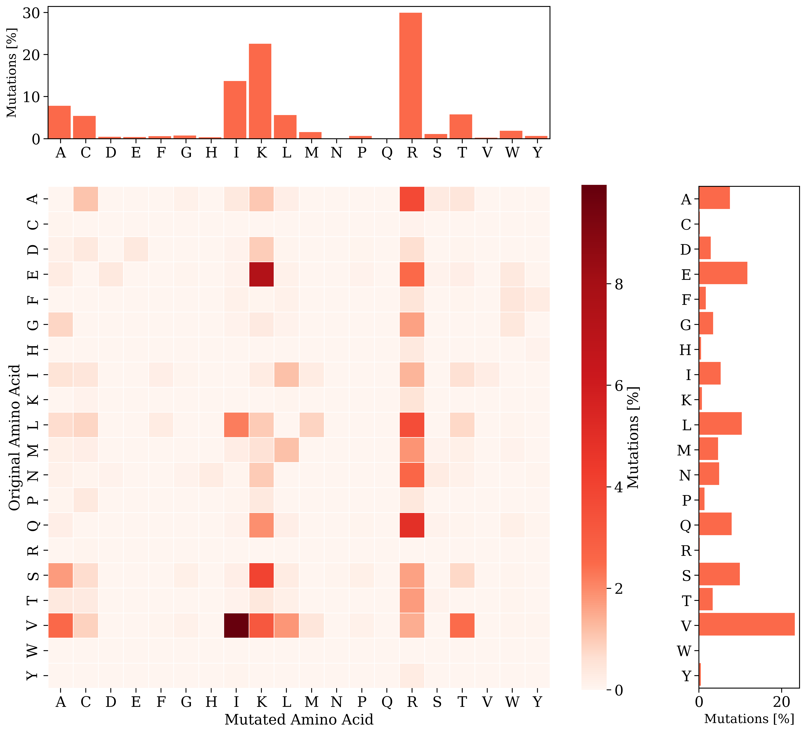
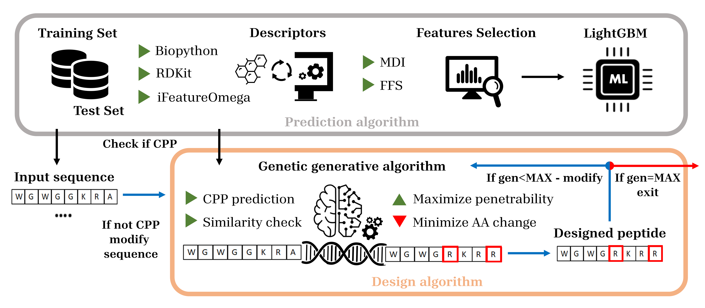

# LightCPPgen: An Explainable Machine Learning Pipeline for Rational Design of Cell Penetrating Peptides

This github repository contains the Python code to reproduce the results of the paper: *LightCPPgen: An Explainable Machine Learning Pipeline for Rational Design of Cell Penetrating Peptides* by Gabriele Maroni, Filip Stojceski, Lorenzo Pallante, Marco A. Deriu, Dario Piga, Gianvito Grasso.

This paper has been submitted for publication in *Nature communications*.




## Abstract
Cell-penetrating peptides (CPPs) are powerful vectors for the intracellular delivery of a diverse array of therapeutic molecules. Despite their potential, the rational design of CPPs remains a challenging task that often requires extensive experimental efforts and iterations. In this study, we introduce an innovative approach for the de novo design of CPPs, leveraging the strengths of machine learning (ML) and optimization algorithms. Our strategy, named LightCPPgen, integrates a LightGBM-based predictive model with a genetic algorithm (GA), enabling the systematic generation and optimization of CPP sequences.  At the core of our methodology is the development of an accurate, efficient, and interpretable predictive model, which utilizes 20 explainable features to shed light on the critical factors influencing CPP translocation capacity.  The CPP predictive model works synergistically with an optimization algorithm, which is tuned to enhance computational efficiency while maintaining optimization performance. The GA solutions specifically target the candidate sequences' penetrability score, while trying to maximize similarity with the original non-penetrating peptide in order to retain its original biological and physicochemical properties. By prioritizing the synthesis of only the most promising CPP candidates, LightCPPgen can drastically reduce the time and cost associated with wet lab experiments. In summary, our research makes a substantial contribution to the field of CPP design, offering a robust framework that combines ML and optimization techniques to facilitate the rational design of penetrating peptides, by enhancing the explainability and interpretability of the design process.



## Software implementation
All the source code used to generate the results and figures in the paper are in the `src` and `notebooks` folders. Computations and figure generation are all run inside [Jupyter notebooks](http://jupyter.org/). Results generated by the code are saved in `results` folder. 

## Getting the code
You can download a copy of all the files in this repository by cloning the
[git](https://git-scm.com/) repository:

    git clone https://github.com/gabribg88/LightCPPgen.git

or [download a zip archive](https://github.com/gabribg88/LightCPPgen/archive/refs/heads/master.zip).

## Requirements
You'll need a working Python environment to run the code.
The recommended way to set up your environment is through the
[Anaconda Python distribution](https://www.anaconda.com/download/) which
provides the `conda` package manager.
Anaconda can be installed in your user directory and does not interfere with
the system Python installation.
The required dependencies are specified in the file `requirements.txt`.

We recommend to use `conda` virtual environments to manage the project dependencies in
isolation.
Thus, you can install the dependencies without causing conflicts, with your
setup (even with different Python versions), with the pip package-management system.

Run the following command in the repository folder (where `requirements.txt`
is located) to create a separate environment and install all required
dependencies in it:

    conda create --name <env_name>
    source activate <env_name>
    pip install -r requirements.txt

## Reproducing the results
Before running any code you must activate the conda environment:

    source activate <env_name>

This will enable the environment for your current terminal session. Any subsequent commands will use software that is installed in the environment.
To reproduce the results of the paper we recommend to execute the Jupyter notebooks individually. To do this, you must first start the notebook server by going into the repository top level and running:

    jupyter lab

This will start the server and open your default web browser to the Jupyter interface. In the page, go into the notebooks folder and select the notebook that you wish to view/run.
The notebook is divided into cells (some have text while other have code). Each cell can be executed using Shift + Enter. Executing text cells does nothing and executing code cells runs the code and produces it's output. To execute the whole notebook, run all cells in order.

To reproduce the results in the paper you have to run the notebooks according to their numerical order (prefix in the name).
In particular, to reproduce the numerical results presented in Table 1 you have to run the following notebooks:

    0_Feature_engineering.ipynb : Performs the feature engineering step integrating physicochemical properties and sequence-based descriptors.
    1_Modeling.ipynb            : Trains the models described in the paper: LightCPP (375 features) after MDI and LightCPP (20 features) after forward feature selection.

To reproduce the results depicted in Figure 2, Figure S1 and Figure S2 you need to run the following notebook:
    
    2_Global_model_interpretation.ipynb : Performs hierarchical clustering of the features based on correlation and performs global SHAP analysis using `PartitionExplainer`.

To reproduce Figure 3 you need to run the following notebooks:

    3_Optimization.ipynb                  : Performs massive optimization and CPPs generation (WARNING: the computation is intensive, it required 3 days on a server with two 64-core AMD EPYC 7742 Processors, 256 GB of RAM).
    4_Optimization_results_analysis.ipynb : Performs analysis on the numerical results of the optimization algorithm.

Finally, to reproduce Figure 4, Figure S3, Figure S4, and Figure S5 you need to run the following notebook:

    5_Local_analysis_optimized_sequences.ipynb : Performs local SHAP analysis using `PartitionExplainer` on selected peptides couple before and after optimization.

## Citation

If you use this code or our findings in your research, please cite:

```
@article{Maroni2024,
  title={LightCPPgen: An Explainable Machine Learning Pipeline for Rational Design of Cell Penetrating Peptides},
  author={Gabriele Maroni, Filip Stojceski, Lorenzo Pallante, Marco A. Deriu, Dario Piga and Gianvito Grasso},
  journal={arXiv preprint arXiv:},
  year={2024},
}
```

 by 

## License

This project is licensed under the terms of the MIT license.

## Acknowledgments


