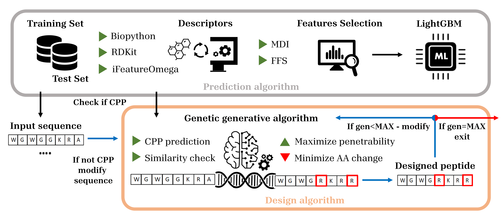

# LightCPPgen

LightCPPgen is an explainable machine-learning pipeline for the rational design of cell-penetrating peptides (CPPs). The code accompanies the paper:

> Gabriele Maroni, Filip Stojceski, Lorenzo Pallante, Marco A. Deriu, Dario Piga, and Gianvito Grasso. LightCPPgen: An Explainable Machine Learning Pipeline for Rational Design of Cell Penetrating Peptides. International Journal of Antimicrobial Agents, 2025. https://doi.org/10.1016/j.ijantimicag.2025.107611

The repository contains the MLCPP2.0 data used in the paper, notebooks for reproducing the analyses, source modules for feature engineering, model training, interpretation and optimization, and the published 20-feature LightGBM model.



## Repository Modes

The code can be used in three different ways.

### 1. Paper Reproduction

Use the original MLCPP2.0 data and the notebooks in `notebooks/` to reproduce the analyses from the paper:

- descriptor calculation
- LightGBM model training
- feature selection
- SHAP interpretation
- genetic-algorithm optimization
- paper figures and supplementary analyses

This is the historical reproduction workflow. Use Python 3.9 and the dependencies in `requirements.txt`.

### 2. Custom Dataset Pipeline

Use the same pipeline on a different CPP/non-CPP dataset. A custom dataset must provide peptide sequences and binary labels. The pipeline can then be reused to:

- create FASTA files
- compute physicochemical and sequence-based descriptors
- train LightGBM classifiers
- perform feature selection
- interpret models with SHAP
- use the optimizer if the trained model uses features that can be computed for newly generated sequences

Important limitation: the current fast optimizer `Featurizer` in `src/optimization.py` is coupled to the 20 selected features used by the published LightCPPgen model. If a newly trained model selects different features, the optimizer is only valid if those features can also be computed for candidate sequences by a compatible featurizer.

See [Custom Dataset Pipeline Mode](docs/CUSTOM_DATASET_PIPELINE.md) for the current custom-dataset workflow and compatibility notes.

### 3. Pretrained Optimizer

Use the published 20-feature LightGBM model in `models/LightCPP_20.pickle` directly on sequences of interest. This mode avoids the full descriptor pipeline and uses the fast 20-feature `Featurizer` implemented in `src/optimization.py`.

This is the simplest mode for users who want to score or optimize peptide sequences without retraining the model.

See [Pretrained Optimizer Mode](docs/PRETRAINED_OPTIMIZER.md) for full usage instructions.

The pretrained optimizer has a lighter dependency file:

```bash
conda create -n lightcppgen-optimizer
conda activate lightcppgen-optimizer
pip install -r requirements-optimizer.txt
```

## Repository Layout

```text
data/       Input datasets and descriptor configuration files
features/   Generated feature matrices; not fully populated in a fresh clone
figures/    Paper figures and generated plots
models/     Published trained model and model placeholders
notebooks/  Reproduction notebooks
results/    Generated analysis and optimization outputs
docs/       Usage guides for repository workflows
scripts/    Utility scripts
src/        Source code used by the notebooks
```

## Installation

The paper-reproduction environment is intentionally conservative. Python 3.9 is recommended.

```bash
conda create -n lightcppgen-paper python=3.9
conda activate lightcppgen-paper
pip install -r requirements.txt
```

Then run the preflight check:

```bash
python scripts/check_paper_inputs.py
```

The script verifies that the expected input data, notebooks, folders and pretrained model are present before running the expensive notebooks.

## Using the Pretrained Optimizer

The script `scripts/lightcppgen_optimizer.py` provides a command-line interface for the published 20-feature model.

Score one or more sequences:

```bash
python scripts/lightcppgen_optimizer.py score \
  --sequences MILPTGPTSFKE ESVVHRVFGRQSLYQRGLGV \
  --output results/scored_sequences.csv
```

Score sequences from a FASTA file:

```bash
python scripts/lightcppgen_optimizer.py score \
  --input data/MLCPP2_Test_optimized.fasta \
  --output results/scored_sequences.csv
```

Score sequences from a CSV file containing a `Sequence` column:

```bash
python scripts/lightcppgen_optimizer.py score \
  --input peptides.csv \
  --sequence-column Sequence \
  --id-column ID \
  --output results/scored_sequences.csv
```

Run the genetic optimizer on one or more input sequences:

```bash
python scripts/lightcppgen_optimizer.py optimize \
  --sequences MILPTGPTSFKE \
  --population-size 500 \
  --max-iter 50 \
  --output results/optimized_sequences.csv
```

For quick tests, use smaller values:

```bash
python scripts/lightcppgen_optimizer.py optimize \
  --sequences MILPTGPTSFKE \
  --population-size 50 \
  --max-iter 5 \
  --output results/optimized_sequences_quick_test.csv
```

The optimizer output includes the input sequence, initial penetration score, initial anomaly score, optimized sequence, optimized penetration score, optimized anomaly score, fitness, number of changed residues, number of generations and stopping reason.

By default, anomaly scores are computed by fitting a `LocalOutlierFactor` model on the bundled MLCPP2.0 training sequences after applying the same 20-feature featurizer. This keeps pretrained optimization independent of the generated `features/comb_*.pickle` files.

## Reproducing the Paper Results

Start JupyterLab from the repository root:

```bash
conda activate lightcppgen-paper
jupyter lab
```

Run the notebooks in numerical order.

### Feature Engineering

```text
0_Feature_engineering.ipynb
```

This notebook computes physicochemical descriptors and sequence-based descriptors, then writes generated feature matrices to `features/`.

Expected input data:

```text
data/MLCPP2_Training.fasta
data/MLCPP2_TrainingCPPvalues.csv
data/MLCPP2_Independent.fasta
data/MLCPP2_IndependentCPPvalues.csv
```

Expected dataset sizes:

```text
training sequences:    1146
independent sequences: 2341
```

### Model Training and Feature Selection

```text
1_Modeling.ipynb
```

This notebook trains the LightGBM models, applies feature selection and saves the final 20-feature model.

Useful checkpoints from the historical run:

```text
initial feature count:              about 13833
after first MDI filtering:          about 2297
after second MDI filtering:         about 375
final forward-selected features:    20
```

Exact bitwise reproducibility is not guaranteed because the workflow depends on library versions, parallel execution and stochastic components. The practical target is scientific reproduction: same workflow, same conclusions, comparable metrics and compatible selected features.

### Global Interpretation

```text
2_Global_model_interpretation.ipynb
```

This notebook performs feature clustering and global SHAP analysis, including the plots corresponding to the global interpretation figures in the paper and supplementary materials.

### Optimization

```text
3_Optimization.ipynb
4_Optimization_results_analysis.ipynb
```

The optimization workflow is computationally expensive. The original run required several days on a large multicore server.

Before using this workflow for a new reproduction run, inspect `3_Optimization.ipynb` carefully and confirm that the loop is configured to process the intended set of non-CPP sequences. In the current repository state, this notebook should be treated as a historical research notebook rather than a polished command-line reproduction script.

### Local Interpretation

```text
5_Local_analysis_optimized_sequences.ipynb
```

This notebook performs local SHAP analysis on selected original/optimized peptide pairs.

### Appendix Notebooks

```text
APPENDIX_Fasta_creation.ipynb
APPENDIX_HPO_Model_Selection.ipynb
```

The HPO/model-selection appendix uses additional estimators, including XGBoost.

## Generated Artifacts

Fresh clones do not necessarily contain all generated intermediate artifacts. The notebooks create files such as:

```text
features/comb_*.pickle
results/shap_values.pickle
results/optimization_results.pickle
models/LightCPP_20.pickle
```

If an analysis notebook fails because a generated file is missing, run the previous notebooks in order first.

## Known Reproducibility Notes

- `matplotlib-inline==0.1.7` is pinned because some notebook environments require it for stable Matplotlib/Jupyter behavior.
- The full descriptor pipeline depends on `iFeatureOmegaCLI`, RDKit, Biopython and peptide descriptor libraries.
- The optimizer currently has a fast featurizer for the 20 features selected in the published model.
- If a custom model uses a different feature subset, feature compatibility must be checked before using the optimizer.
- The optimization notebook is expensive and should be made resumable/checkpointed before launching long runs.

## Citation

If you use this code or the LightCPPgen methodology, please cite:

```bibtex
@article{Maroni2025LightCPPgen,
  title = {LightCPPgen: An Explainable Machine Learning Pipeline for Rational Design of Cell Penetrating Peptides},
  author = {Maroni, Gabriele and Stojceski, Filip and Pallante, Lorenzo and Deriu, Marco A. and Piga, Dario and Grasso, Gianvito},
  journal = {International Journal of Antimicrobial Agents},
  year = {2025},
  doi = {10.1016/j.ijantimicag.2025.107611}
}
```

## License

This project is licensed under the terms of the MIT license.
